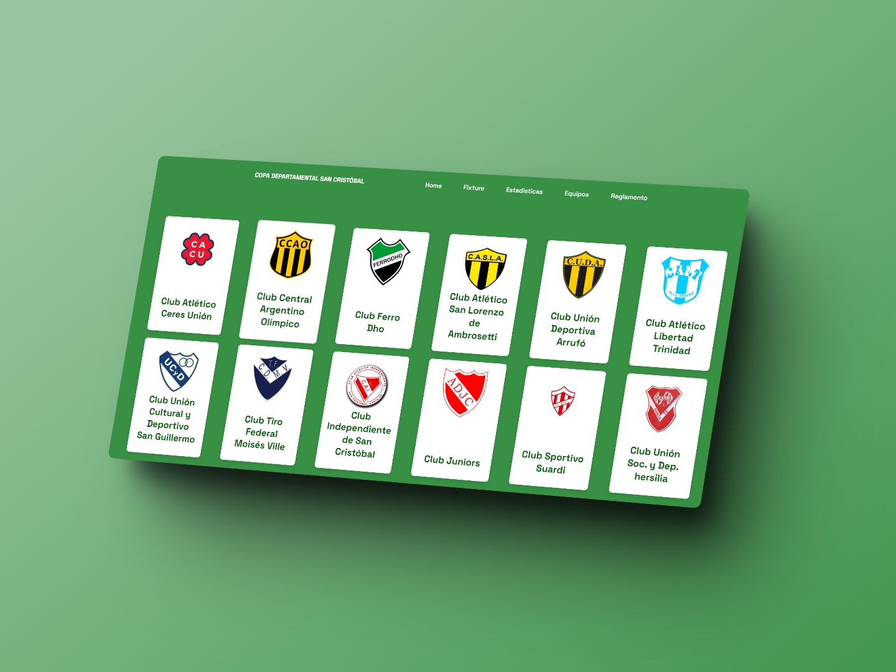

# Copa Departamental San Cristóbal - Santa Fe
## Desarrollo de aplicación web para estadísticas y resultados del torneo.

El proyecto es un desarrollo de una página básica donde se puedan visualizar los partidos, reglamentos, participantes, y más estadísticas. 

- Fixture de partidos.
- Equipos que participan.
- Reglamento del torneo (ya que es la primera vez que se jugará).
- Stats, etc.

## Funcionamiento y objetivo

- En principio se muestra una home amigable. (Ver aclaraciones)
- Brindar facilmente los resultados y los partidos para que sirva como herramienta informativa.
- Realizar calculos de partidos/estadísticas que se muestren de una forma innovadora y siguiendo lo anterior.

## Aclaraciones

Los conocimientos en ámbito web es escasa, el proyecto sirve para indagar en ello, pero dado a que es una necesidad y la herramienta más usada en este caso es una aplicación web se optó por ello.

## Entrañas

El frontend está en HTML/CSS guíado por diseños de código abierto (nombrados en los links). Dado a que es una página básica en funcionalidades, el backend (Jscript) se usa para algunas animaciones y para detectar los partidos.
Dado a que el proyecto no va a desplegarse, en principio, en un proovedor de pago sino que en GitHub Pages, estamos sujetos al manejo estático. Por la poca cantidad de partidos a jugarse, no se usa una base de datos sino que en JSONs configurados para mostrarse en las tablas.

## Pantallas (se van actualizando con el proyecto)

## License

MIT

**Free Software, Hell Yeah!**

[//]: # (These are reference links used in the body of this note and get stripped out when the markdown processor does its job. There is no need to format nicely because it shouldn't be seen. Thanks SO - http://stackoverflow.com/questions/4823468/store-comments-in-markdown-syntax)

   [dill]: <https://github.com/joemccann/dillinger>
   [git-repo-url]: <https://github.com/joemccann/dillinger.git>
   [john gruber]: <http://daringfireball.net>
   [df1]: <http://daringfireball.net/projects/markdown/>
   [markdown-it]: <https://github.com/markdown-it/markdown-it>
   [Ace Editor]: <http://ace.ajax.org>
   [node.js]: <http://nodejs.org>
   [Twitter Bootstrap]: <http://twitter.github.com/bootstrap/>
   [jQuery]: <http://jquery.com>
   [@tjholowaychuk]: <http://twitter.com/tjholowaychuk>
   [express]: <http://expressjs.com>
   [AngularJS]: <http://angularjs.org>
   [Gulp]: <http://gulpjs.com>

   [PlDb]: <https://github.com/joemccann/dillinger/tree/master/plugins/dropbox/README.md>
   [PlGh]: <https://github.com/joemccann/dillinger/tree/master/plugins/github/README.md>
   [PlGd]: <https://github.com/joemccann/dillinger/tree/master/plugins/googledrive/README.md>
   [PlOd]: <https://github.com/joemccann/dillinger/tree/master/plugins/onedrive/README.md>
   [PlMe]: <https://github.com/joemccann/dillinger/tree/master/plugins/medium/README.md>
   [PlGa]: <https://github.com/RahulHP/dillinger/blob/master/plugins/googleanalytics/README.md>