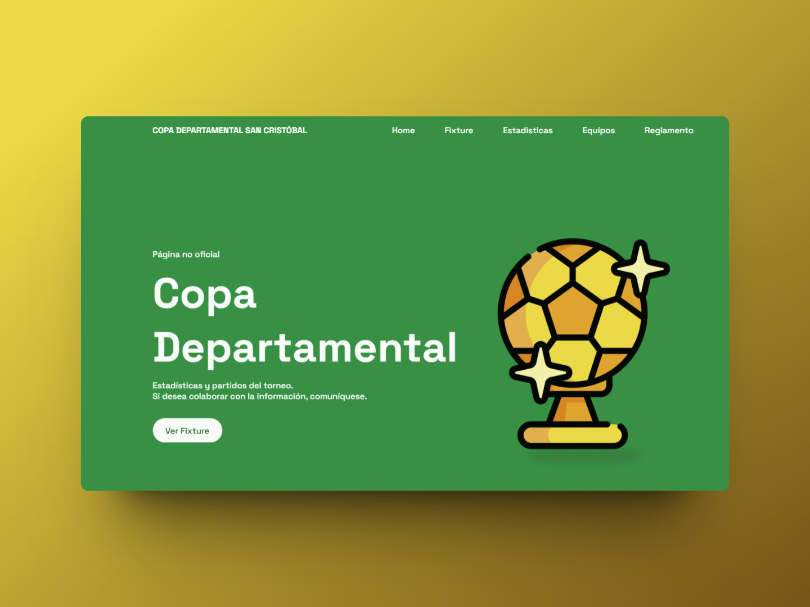

# Copa Departamental San Cristóbal - Santa Fe
## Desarrollo de aplicación web para estadísticas y resultados del torneo.

Authors: 
* __[Guido Rivoira](https://github.com/GuiDev404)__
* __[Luciano Rodriguez](https://github.com/Lucho-rar)__

El proyecto es un desarrollo de una página básica donde se puedan visualizar los partidos, reglamentos, participantes, y más estadísticas. 

- Fixture de partidos.
- Equipos que participan.
- Reglamento del torneo (ya que es la primera vez que se jugará).
- Stats, etc.

## Funcionamiento y objetivo

- En principio se muestra una home amigable.
- Brindar facilmente los resultados y los partidos para que sirva como herramienta informativa.
- Realizar calculos de partidos/estadísticas que se muestren de una forma innovadora y siguiendo lo anterior.

## Pantallas (se van actualizando con el proyecto)

## Reutilización de estilos from
* __[Bedimcode](https://www.youtube.com/watch?v=WG2l4ER3_Qc&t=1220s)__

